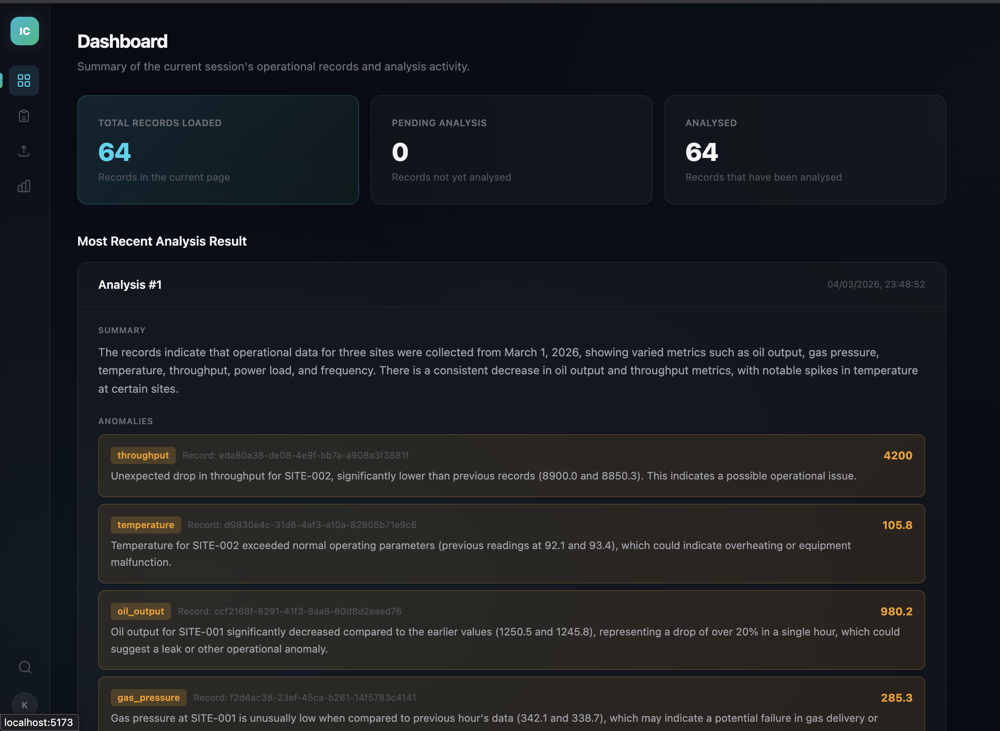
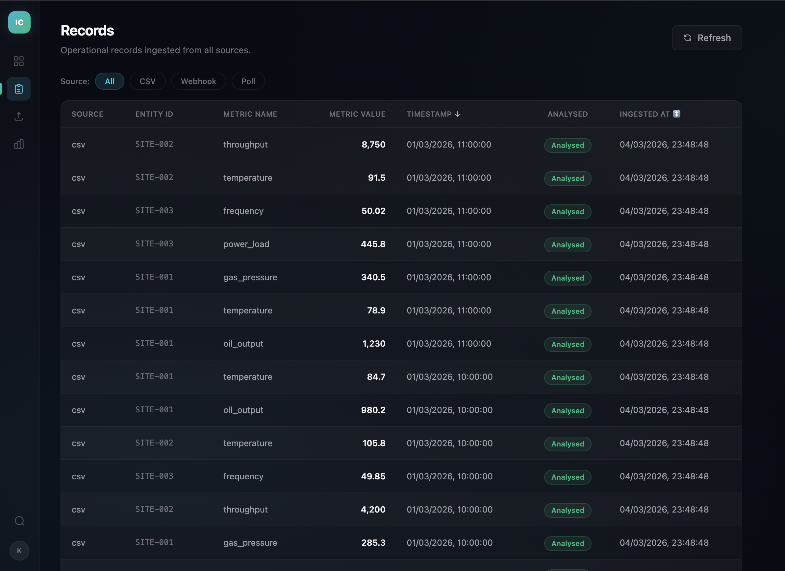
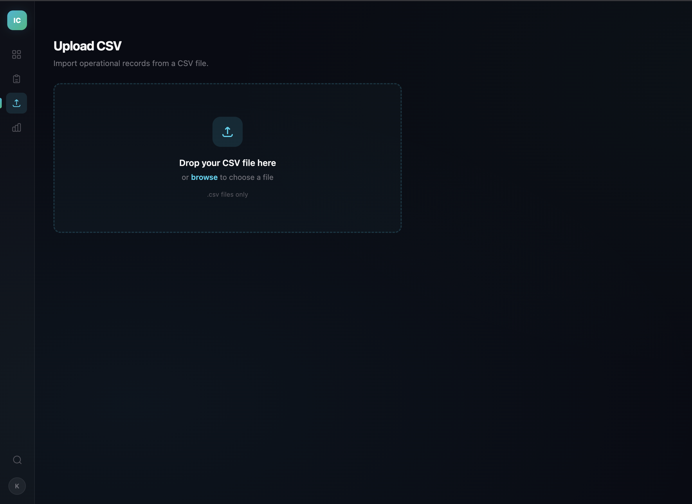
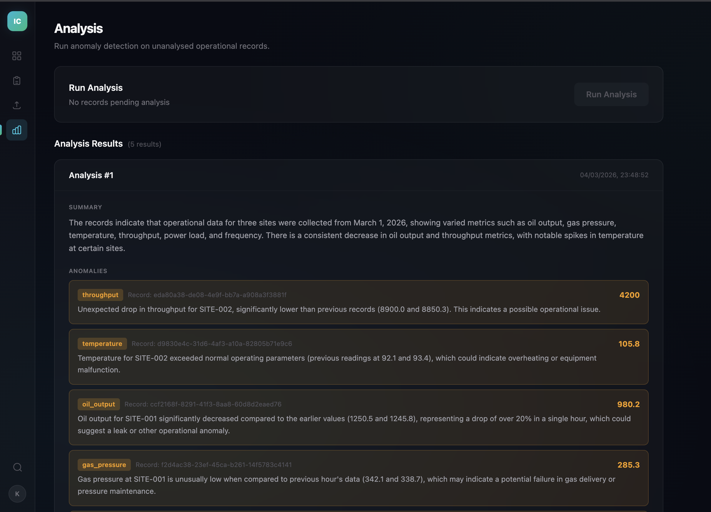

# IndustryConnect

A full-stack application for ingesting operational data through multiple channels, storing it in PostgreSQL, and using OpenAI to produce plain-English summaries and anomaly detection. The React frontend provides a browser-based interface for all backend capabilities.

## Screenshots

### Dashboard


### Records


### Upload


### Analysis


## What It Does

IndustryConnect accepts data from three ingestion paths — CSV file upload, webhook, and a background poller — normalises every record into a consistent schema, and stores it in PostgreSQL. An analysis endpoint sends unprocessed records to an LLM (GPT-4o-mini by default) and returns summaries with flagged anomalies. For large inputs, it automatically splits records into chunks and uses a map-reduce strategy to stay within token limits.

The React frontend provides four views: a dashboard with summary stats, a paginated records table with filtering and auto-polling, a CSV upload form with error handling, and an analysis trigger with session-scoped result history.

## Tech Stack

**Backend:** Python 3.12, FastAPI, SQLAlchemy, PostgreSQL 16, Alembic, OpenAI API, pydantic-settings

**Frontend:** React 19, TypeScript, Vite 7, Tailwind CSS v4, React Router v7, TanStack Query v5

**Infrastructure:** Docker Compose, nginx (frontend reverse proxy), GitHub Actions CI

## Endpoints

| Method | Path | Description |
|--------|------|-------------|
| `POST` | `/upload/csv` | Upload a CSV file with optional column mapping. Returns `{records, mappings_applied}` (201) or validation errors (422). |
| `POST` | `/webhook` | Submit a single record as JSON. Returns the created record (201). |
| `POST` | `/analyse` | Analyse all unprocessed records via OpenAI. Returns analysis results. |
| `GET` | `/analyse` | Retrieve stored analysis results. Supports `limit` (default 100, max 1000) and `offset`. Most recent first. |
| `GET` | `/records` | Retrieve ingested records. Supports `limit` (default 100, max 1000) and `offset` query params. |
| `GET` | `/health` | Health check. Returns `{"status": "ok"}`. |
| `GET` | `/docs` | Interactive API documentation (Swagger UI). |

## Quick Start

### Prerequisites

- Python 3.12+
- Node.js 20+ and npm (for frontend development)
- PostgreSQL 16 (local or Docker)
- An OpenAI API key

### Option 1: Docker Compose (recommended)

```bash
# Clone the repo
git clone https://github.com/KAB2021/industry-connect.git
cd industry-connect

# Create your .env file
cp .env.example .env
# Edit .env — set POSTGRES_PASSWORD and OPENAI_API_KEY at minimum

# Start everything
docker-compose up --build
```

This starts three services:
- **PostgreSQL** on port 5433
- **Backend API** on port 8000
- **Frontend** on port 3000

Open `http://localhost:3000` for the UI, or `http://localhost:8000/docs` for the API docs. Migrations run automatically on startup.

### Option 2: Local Development

**Backend:**

```bash
# Clone and enter the repo
git clone https://github.com/KAB2021/industry-connect.git
cd industry-connect

# Create and activate a virtual environment
python -m venv .venv
source .venv/bin/activate

# Install dependencies
pip install -r requirements.txt

# Create your .env file
cp .env.example .env
# Edit .env — set DATABASE_URL to point to your local Postgres and add your OPENAI_API_KEY

# Create the database
createdb industryconnect
createdb industryconnect_test  # for tests

# Run migrations
alembic upgrade head

# Start the server
uvicorn app.main:app --reload
```

**Frontend:**

```bash
cd frontend

# Install dependencies
npm install

# Start the dev server (proxies API requests to localhost:8000)
npm run dev
```

The frontend dev server runs at `http://localhost:5173` and automatically proxies API requests to the backend via Vite's dev server proxy.

## Frontend Views

**Dashboard** — Summary stats showing total records loaded, count of records pending analysis, and the most recent analysis result.

**Records** — Paginated table displaying operational records with columns for source, entity ID, metric name/value, timestamp, analysed status, and ingested time. Supports client-side filtering by source (csv, webhook, poll) and sorting by timestamp or ingested_at. Auto-polls every 30 seconds (configurable via `VITE_POLL_INTERVAL_MS`) with a manual refresh button.

**Upload** — CSV file upload form targeting `POST /upload/csv`. Displays ingested count on success (201), a row-level error table on validation failure (422), and a size-exceeded message on 413.

**Analysis** — Trigger button calling `POST /analyse`. Shows results with summary text, anomalies list, and token usage. Disables when no unanalysed records exist. Persisted result history fetched from `GET /analyse` and displayed in reverse chronological order.

## Configuration

All configuration is via environment variables (loaded from `.env`):

| Variable | Default | Description |
|----------|---------|-------------|
| `DATABASE_URL` | — | PostgreSQL connection string |
| `TEST_DATABASE_URL` | — | Separate database for tests |
| `OPENAI_API_KEY` | — | OpenAI API key |
| `OPENAI_MODEL` | `gpt-4o-mini` | Model used for analysis |
| `POLL_INTERVAL_SECONDS` | `60` | Seconds between poller cycles |
| `POLL_SOURCE_URL` | `""` | URL the background poller fetches from |
| `MAX_UPLOAD_BYTES` | `10485760` | Max upload size in bytes (10 MB) |
| `TOKEN_THRESHOLD` | `4000` | Token count that triggers map-reduce |
| `CORS_ALLOWED_ORIGINS` | `http://localhost:5173` | Comma-separated origins for CORS middleware |
| `POSTGRES_USER` | `appuser` | PostgreSQL username (Docker Compose) |
| `POSTGRES_PASSWORD` | — | PostgreSQL password (Docker Compose, required) |
| `POSTGRES_DB` | `industryconnect` | PostgreSQL database name (Docker Compose) |

**Frontend (build-time):**

| Variable | Default | Description |
|----------|---------|-------------|
| `VITE_API_BASE_URL` | `/api` | Backend API base URL prefix; Vite proxy rewrites `/api/*` to backend |
| `VITE_POLL_INTERVAL_MS` | `30000` | Records auto-poll interval in milliseconds |

## Usage Examples

### Upload a CSV

```bash
# Standard upload with canonical column names
curl -X POST http://localhost:8000/upload/csv \
  -F "file=@data.csv"

# Upload with aliased columns and an explicit mapping
curl -X POST http://localhost:8000/upload/csv \
  -F "file=@data.csv" \
  -F 'column_mapping={"timestamp": "ts"}'
```

The CSV needs four columns: `timestamp`, `entity_id`, `metric_name`, `metric_value`. Common aliases are resolved automatically (e.g. `site_id` → `entity_id`, `metric` → `metric_name`, `value` → `metric_value`). All matching is case-insensitive. For non-standard names, pass an explicit `column_mapping` JSON string.

The response includes a `mappings_applied` object showing how each column was resolved:

```json
{"records": [...], "mappings_applied": {"timestamp": "timestamp", "entity_id": "site_id", "metric_name": "metric", "metric_value": "value"}}
```

Invalid rows return a 422 with per-row error details:

```json
{"errors": [{"row": 2, "field": "metric_value", "message": "Not a valid float"}]}
```

### Send a webhook

```bash
curl -X POST http://localhost:8000/webhook \
  -H "Content-Type: application/json" \
  -d '{
    "timestamp": "2026-03-04T12:00:00Z",
    "entity_id": "machine-42",
    "metric_name": "temperature",
    "metric_value": 87.5
  }'
```

### Run analysis

```bash
curl -X POST http://localhost:8000/analyse
```

This processes all records where `analysed=false`, sends them to OpenAI, and returns summaries with anomalies. Records are marked `analysed=true` after processing so they aren't re-analysed.

### Retrieve analysis results

```bash
curl "http://localhost:8000/analyse?limit=10&offset=0"
```

Returns stored analysis results ordered by most recent first.

### Retrieve records

```bash
curl "http://localhost:8000/records?limit=50&offset=0"
```

## Architecture

```
frontend/
  src/
    api/             # Typed fetch wrapper + TypeScript interfaces
    hooks/           # TanStack Query hooks (useRecords, useUploadCSV, useAnalysis, useAnalysisResults)
    pages/           # DashboardPage, RecordsPage, UploadPage, AnalysisPage
    components/      # RecordsTable, AnalysisResultCard
    layouts/         # AppLayout (persistent nav bar)
    App.tsx          # Router with 4 routes
    main.tsx         # QueryClientProvider + RouterProvider
  Dockerfile         # Multi-stage: Node 20 Alpine → nginx Alpine
  nginx.conf         # SPA fallback + reverse proxy for API paths
  vite.config.ts     # Build config + dev proxy to localhost:8000

app/
  main.py            # FastAPI app, lifespan, CORS middleware, exception handlers
  config.py          # Pydantic Settings (.env parsing)
  db/                # SQLAlchemy engine, session, Base
  models/            # ORM models (OperationalRecord, AnalysisResult)
  schemas/           # Pydantic request/response schemas
  routers/           # Endpoint handlers (ingestion, webhook, records, analysis)
  services/          # Business logic (csv_parser, analysis, chunking, poller, token_counter)

alembic/             # Database migrations
tests/               # 104 tests across all layers
```

### Docker Service Topology

```
postgres:5432 ← app:8000 ← frontend:80 (host :3000)
```

In development, Vite's dev server proxy forwards `/api/*` requests from `localhost:5173` to `localhost:8000` (stripping the `/api` prefix). This avoids route collisions between frontend routes (e.g. `/records`) and backend API paths. In production (Docker), nginx proxies API paths to the backend container on the Docker network and serves static assets with SPA fallback routing.

### How Analysis Works

1. All unprocessed records (`analysed=false`) are loaded.
2. Records are serialised to JSON and token-counted via `tiktoken`.
3. **If within the token threshold**: a single OpenAI call produces the summary and anomalies.
4. **If over the threshold** (map-reduce): records are split into token-bounded chunks, each chunk is summarised independently, then chunk summaries are combined in a reduce step (bounded to 5 iterations max).
5. Results are persisted and records are marked as analysed.

### Background Poller

An async task started in FastAPI's lifespan context manager. It fetches JSON from `POLL_SOURCE_URL` on a configurable interval and persists each item as an `OperationalRecord` with `source="poll"`. If no URL is configured, the poller does nothing.

## Testing

```bash
# Run all tests
pytest

# Run with verbose output
pytest -v

# Run a specific test file
pytest tests/test_csv_ingestion.py
```

Tests use a separate `TEST_DATABASE_URL` database. OpenAI calls are mocked with `respx` — no real API calls are made. Test isolation uses DELETE cleanup after each test.

### Linting and Type Checking

```bash
ruff check .     # Lint
mypy app/        # Type check
```

### Frontend

```bash
cd frontend
npm run lint     # ESLint
npm run build    # TypeScript check + production build
```

## CI

GitHub Actions runs on every push and PR to `main`:

1. Spins up a PostgreSQL 16 service container
2. Runs Alembic migrations
3. Lints with ruff
4. Type checks with mypy
5. Runs the full test suite

## Design

The UI uses a **Midnight Neon** dark glassmorphism theme with a deep navy background (`#080C14`), cyan-to-emerald gradient accents, frosted glass cards, and a fixed icon sidebar. Design tokens are defined via Tailwind CSS v4 `@theme` in `frontend/src/index.css`.

## Design Decisions

| Decision | Choice | Why |
|----------|--------|-----|
| Sync SQLAlchemy (psycopg2) | Over async (asyncpg) | Simpler Alembic integration, avoids MissingGreenlet issues, FastAPI runs sync routes in thread pool automatically |
| Custom map-reduce | Over LangChain | ~50 lines of code, no heavy dependency, demonstrates understanding of the pattern |
| React Router v7 | Over TanStack Router | Simple 4-route SPA; TanStack Router's type-safety not justified for this scope |
| TanStack Query v5 | Over manual fetch | Built-in `refetchInterval`, `useMutation`, cache deduplication |
| Native `fetch` | Over Axios | Zero bundle cost; no upload-progress requirement |
| Vite dev proxy + nginx prod | Over CORS-only | Same-origin in dev avoids CORS complexity; nginx handles routing in production |
| `asyncio.create_task` for poller | Over APScheduler | Zero extra dependencies, sufficient for a single-interval task |
| `respx` for test mocking | Over openai-responses | Intercepts httpx directly, no vendor plugin needed |
| GPT-4o-mini default | Over GPT-4.1 mini | 2.7x cheaper per token, configurable via env var |

## License

This project is part of a portfolio. See the repository for details.
